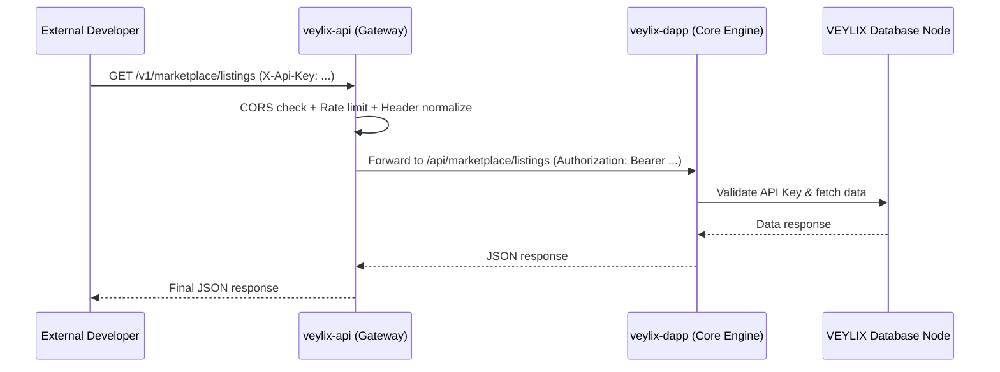

<div align="center">
  <br />
  
  <h1>VEYLIX API Gateway</h1>
  <p>
    <strong>The High-Performance, Secure, and Scalable Reverse Proxy for the VEYLIX Ecosystem.</strong>
  </p>
  <p>
    <a href="https://veylixlabs.xyz"></a>
    <a href="https://github.com/VeylixLabs/veylix-api/blob/main/LICENSE"></a>
    <a href="https://typescriptlang.org"></a>
    <a href="https://expressjs.com"></a>
    
    
  </p>
</div>

<br />

## 📖 Overview

**`veylix-api`** is the official API Gateway and Reverse Proxy for the VEYLIX Network. It serves as the secure bridge between external third-party developers and the core `veylix-dapp` engine.

By abstracting away the internal routing of the dApp infrastructure, `veylix-api` provides a clean, predictable, and performant `v1` RESTful interface — with API Key normalization, CORS enforcement, rate limiting, DDoS protection, and interactive API documentation built in.

---

## ✨ Features

- 🚀 **Blazing Fast Proxying:** Express + `http-proxy-middleware` for minimal overhead.
- 🔐 **Smart Auth Resolution:** Accepts both `X-Api-Key` headers and `Authorization: Bearer` tokens, normalizing them transparently before forwarding.
- 🛡️ **CORS Whitelist:** Only permits requests from known VEYLIX origins (`veylixlabs.xyz`, `dapp.veylixlabs.xyz`, `app.veylixlabs.xyz`). CLI/SDK calls without an `Origin` header are always allowed through.
- 🧱 **Security Headers:** Hardened with `helmet` (CSP, HSTS, X-Frame-Options, etc.).
- ⏱️ **DDoS Protection:** 100 requests per 15 minutes per IP via `express-rate-limit`.
- 📖 **Interactive API Docs:** Swagger UI served at `/api/docs` — no login required.
- ✅ **Tested:** 13 unit/integration tests via Vitest + supertest.
- 🔄 **CI/CD:** GitHub Actions — tests on every push/PR, deploy on merge to `main`.

---

## 🏗️ Architecture Flow



---

## 🚀 Quick Start

### 1. Prerequisites
- [Node.js](https://nodejs.org/) (v18.x or later)
- [npm](https://npmjs.com)

### 2. Installation

```bash
git clone https://github.com/VeylixLabs/veylix-api.git
cd veylix-api
npm install
```

### 3. Environment Variables

Create a `.env` file in the root directory:

```env
PORT=8080
DAPP_URL=https://dapp.veylixlabs.xyz

# Optional: add a custom allowed CORS origin for local dev/staging
ALLOWED_ORIGIN=http://localhost:3000
```

### 4. Development

```bash
npm run dev        # Watch mode with tsx
npm test           # Run all 13 tests
npm run test:watch # Tests in interactive watch mode
```

### 5. Production Build

```bash
npm run build
npm start
```

---

## 📖 API Documentation

Once the gateway is running, visit:

```
http://localhost:8080/api/docs
```

This serves the **Swagger UI** — an interactive explorer for all available `/v1` endpoints. The raw OpenAPI 3.0.3 spec is also available as JSON:

```
http://localhost:8080/api/docs.json
```

---

## 💻 Usage Examples

> **Note:** Generate a Developer API Key from the VEYLIX dApp Developer Console first.

```bash
# Using X-Api-Key header (normalized to Bearer by the gateway)
curl http://localhost:8080/v1/marketplace/listings?limit=5 \
  -H "X-Api-Key: vyx_YourApiKeyHere"

# Using Authorization: Bearer directly
curl http://localhost:8080/v1/assets/asset-abc123 \
  -H "Authorization: Bearer vyx_YourApiKeyHere"

# Health check (no auth required)
curl http://localhost:8080/health
```

---

## 🔒 Security Posture

| Layer | Mechanism |
| :--- | :--- |
| Security headers | `helmet` (CSP, HSTS, X-Frame-Options, nosniff) |
| CORS | Explicit origin whitelist — unknown origins blocked |
| Rate limiting | 100 req / 15 min per IP (`express-rate-limit`) |
| Auth normalization | `X-Api-Key` → `Authorization: Bearer` at gateway edge |
| Upstream auth | `withAuth` HOC in `veylix-dapp` validates all API Keys |
| Key storage | Only key hashes are stored — lost keys cannot be recovered |
| AI task timeout | 5-minute proxy timeout for long-running 3D generation tasks |

---

## 🧪 Testing

```bash
npm test
```

The test suite covers: health endpoint, 404 fallback, CORS origin enforcement (allowed + blocked), header normalization (`X-Api-Key` → `Authorization`), and Helmet security header presence.

---

<div align="center">
  <br />
  <p>Built with 💜 by the <a href="https://github.com/VeylixLabs">VeylixLabs Team</a></p>
</div>
